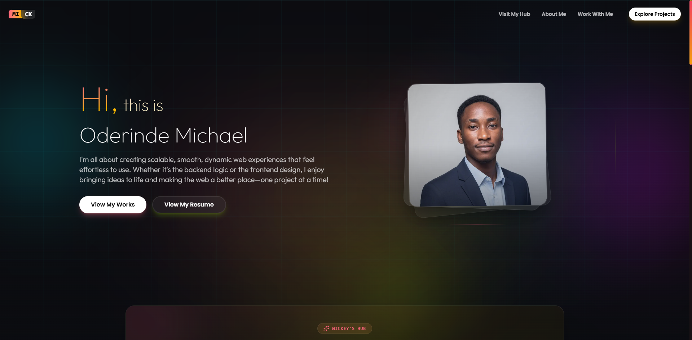

# Michael Oderinde – Personal Portfolio

Oderinde Michael's Portfolio



## ✨ Features

- **🎨 Neon Glass Aesthetic** – Warm rose/amber gradients, glassmorphism, and subtle floating orbs.
- **📱 Fully Responsive** – Optimized for all screen sizes
- **⚡ Next.js App Router** – Server components, dynamic routes, and SEO‑friendly metadata.
- **🧩 Reusable Component System** – Modular `Container`, `Button`, `GlassPanel`, and `ProjectSplashCard`.
- **📂 Dynamic Case Studies** – Deep engineering breakdowns for each project.
- **🔍 SEO Optimized** – Custom metadata, Open Graph images, and semantic HTML.
- **🖱️ Interactive Elements** – Expanding modals, scroll animations, and a cursor glow effect.
- **📄 Resume Integration** – Preview modal and dedicated resume page with PDF download.
- **🧪 My Hub** – A personal lab showcasing side projects, experiments, and currently‑brewing ideas.

## 🛠️ Tech Stack

| Category            | Technologies                                                                                                                                           |
| ------------------- | ------------------------------------------------------------------------------------------------------------------------------------------------------ |
| **Framework**       | [Next.js 15](https://nextjs.org/) (App Router)                                                                                                         |
| **Language**        | [TypeScript](https://www.typescriptlang.org/)                                                                                                          |
| **Styling**         | [Tailwind CSS v4](https://tailwindcss.com/) (CSS‑based configuration)                                                                                  |
| **Animations**      | [Framer Motion](https://www.framer.com/motion/)                                                                                                        |
| **Icons**           | [Lucide React](https://lucide.dev/), [React Icons](https://react-icons.github.io/react-icons/)                                                         |
| **Fonts**           | Outfit, Geist, Fira Code (via `next/font`)                                                                                                             |
| **Package Manager** | npm / yarn / pnpm                                                                                                                                      |
| **Deployment**      | [Vercel](https://vercel.com/)                                                                                                                          |

## 📁 Project Structure

```
src/
├── app/                      # Next.js App Router
│   ├── layout.tsx            # Root layout (global providers, fonts, metadata)
│   ├── page.tsx              # Homepage
│   ├── globals.css           # Tailwind import + design tokens + utilities
│   ├── about-me/             # /about-me route
│   ├── contact-me/           # /contact-me route
│   ├── hire-me/              # /hire-me route
│   ├── my-hub/               # /my-hub route
│   ├── projects/             # /projects route
│   │   ├── page.tsx
│   │   └── [slug]/case-study/
│   └── resume/               # /resume route
├── components/               # Reusable UI components
│   ├── ui/                   # Atomic components (Button, Container, Card, GlassPanel)
│   ├── layout/               # Navbar, Footer, GridBackground, CursorGlow, FloatingOrbs
│   └── sections/             # Page‑specific sections (Hero, ProjectsPreview, etc.)
├── lib/                      # Data, types, utilities
│   ├── projectsData.ts       # All project details + case studies
│   ├── stacksData.ts         # Tech stack definitions
│   ├── types.ts              # TypeScript interfaces
│   ├── utils.ts              # Helper functions (cn, etc.)
│   └── iconMap.ts            # Maps icon strings to components
├── hooks/                    # Custom React hooks
└── assets/                   # Images, SVGs, fonts
```

## 🚀 Getting Started

### Prerequisites

- Node.js 18+  
- npm, yarn, or pnpm

### Installation

1. **Clone the repository**

   ```bash
   git clone https://github.com/Timonics/my-portfolio.git
   cd portfolio
   ```

2. **Install dependencies**

   ```bash
   npm install
   # or
   yarn install
   # or
   pnpm install
   ```

3. **Add required assets**

   - Place your profile picture at `src/assets/jpg/Portfolio-pic1.jpg`
   - Add font files (Geist, Satoshi) to `public/fonts/` (optional – fallback to Google Fonts)
   - Place your resume PDF at `public/resume.pdf`
   - (Optional) Add a resume preview image at `public/resume-preview.png`

4. **Run the development server**

   ```bash
   npm run dev
   ```

   Open [http://localhost:3000](http://localhost:3000) to view the site.

## 🎨 Customization

### Updating Personal Information

- **`src/lib/projectsData.ts`** – Edit the `PROJECTS` array with your own work. Each project includes a full `caseStudy` object.
- **`src/lib/stacksData.ts`** – Modify the tech stack list.
- **`src/app/layout.tsx`** – Update site metadata (title, description, Open Graph image).
- **`public/`** – Replace `Portfolio-pic1.jpg`, `resume.pdf`, and `og-image.png`.

### Changing the Color Scheme

The design tokens are defined in `src/app/globals.css` inside the `@theme` block:

```css
@theme {
  --color-accent-rose: #f43f5e;
  --color-accent-amber: #f59e0b;
  --color-accent-lime: #84cc16;
  /* ... */
}
```

Adjust these hex values to match your preferred palette.

### Adding a New Project

1. Add a new entry to the `PROJECTS` array in `src/lib/projectsData.ts`.
2. Provide a unique `name` (slug), `title`, `subtitle`, `desc`, `tags`, `iconName`, `gradient`, `textColor`, etc.
3. Populate the `caseStudy` object with the relevant sections.
4. If using a new icon, add it to `src/lib/iconMap.ts`.

## 📦 Deployment

The portfolio is optimized for deployment on **Vercel**:

1. Push your repository to GitHub.
2. Import the project into Vercel.
3. Vercel will automatically detect Next.js and configure the build settings.
4. Deploy!

For other platforms (Netlify, Cloudflare Pages), follow their Next.js deployment guides.

## 🧪 Available Scripts

| Command           | Description                                     |
| ----------------- | ----------------------------------------------- |
| `npm run dev`     | Start the development server                    |
| `npm run build`   | Create a production build                       |
| `npm run start`   | Start the production server (after build)       |
| `npm run lint`    | Run ESLint                                      |

## 📄 License

This project is open source and available under the [MIT License](LICENSE).

## 🙏 Acknowledgements

- Icons by [Lucide](https://lucide.dev/) and [React Icons](https://react-icons.github.io/react-icons/).
- Fonts: [Outfit](https://fonts.google.com/specimen/Outfit), [Geist](https://vercel.com/font), [Fira Code](https://fonts.google.com/specimen/Fira+Code).